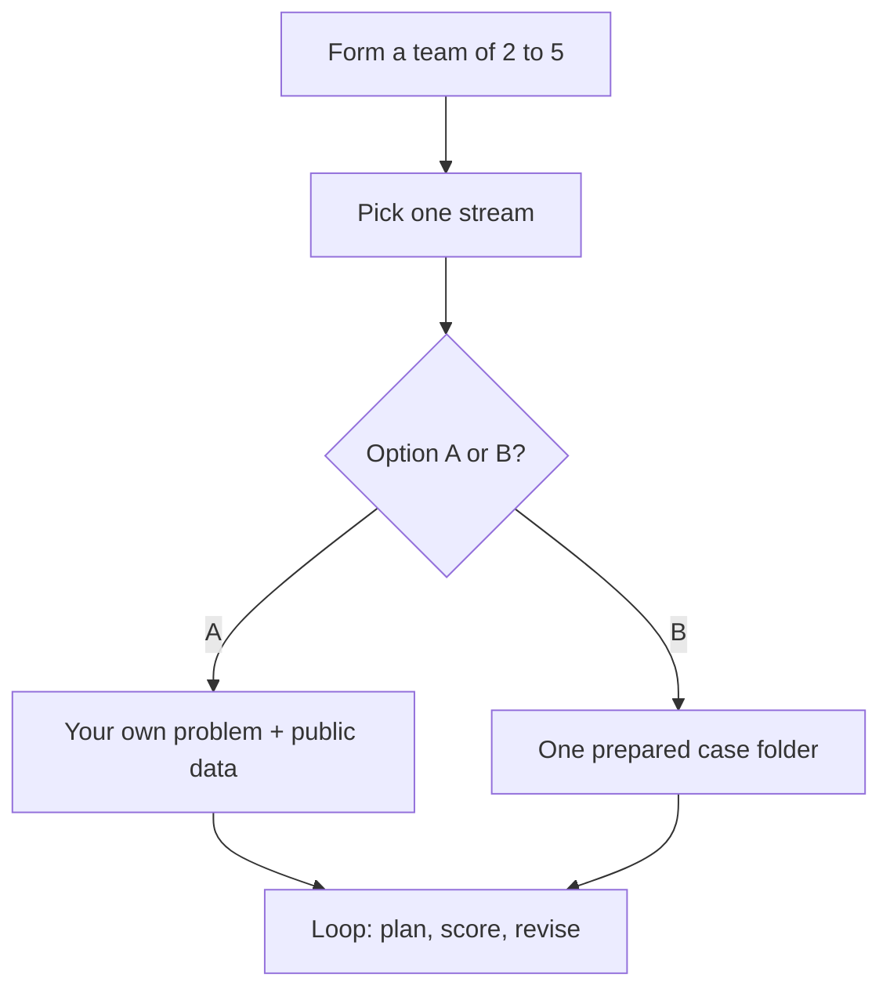

# IEEE YP Industry Hackathon: Autonomous Intelligence for Industrial Innovation

[](https://nagusubra.github.io/traffic/doc/metric/industry-hackathon-lab/)

**Hosted by:** IEEE Southern Alberta Section Young Professionals (IEEE SAS YP)
**Dates:** Friday, October 2 – Sunday, October 4, 2026 (Fri, Oct 2nd – Sun, Oct 4th)
**Duration:** 48-hour hackathon (48 hours)
**Location:** Collision Space, Hunter Hub, University of Calgary
**Website:** [southern-alberta.ieeecanada.org](https://southern-alberta.ieeecanada.org/)
**Kickoff Slides:** [Industry Hackathon – Kickoff Deck](https://canva.link/f4u4rlrgfjq2fky)

---

## Our Sponsors

| Sponsor | Role | Link |
|---|---|---|
| **Hunter Hub** | Venue Sponsor | [ucalgary.ca/hunter-hub](https://www.ucalgary.ca/hunter-hub) |
| **ElevenLabs** | AI Sponsor | [elevenlabs.io/about](https://elevenlabs.io/about) |
| **Volaris Group** | Gold Sponsor | [volarisgroup.com](https://www.volarisgroup.com/) |
| **Databricks** | Cloud Sponsor | [databricks.com](https://www.databricks.com/) |
| **Eudaimonia** | Community Sponsor | [eudaimoniayyc.vercel.app](https://eudaimoniayyc.vercel.app/) |
| **TechConnect** | Community Sponsor | [techconnect.amgfoundation.ca](https://techconnect.amgfoundation.ca/) |

---

## Mission

Join the IEEE Southern Alberta Section Young Professionals for a 48-hour hackathon focused on developing Autonomous AI Agents to solve critical "hard science" bottlenecks across modern industrial sectors. Designed to move beyond basic productivity tools and simple chat interfaces, teams of 2 to 5 members will build advanced agent frameworks capable of reasoning through complex physical, mathematical, and engineering challenges.

---

## Event Schedule (MDT)

| Phase / Event | Date & Time (MDT) | Notes |
|---|---|---|
| Official Kickoff & Team Formation | Friday, Oct 2 @ 5:00 PM | Opening remarks, track briefing, team formation |
| Hacking, Mentorship & Technical Support | Saturday, Oct 3 (All Day) | Build, iterate, and get help from mentors |
| Project Submissions Close | Sunday, Oct 4 @ 12:00 PM | Project submission with screenshots and optional video |
| Project Judging & Shortlisting | Sunday, Oct 4 @ 1:00 PM – 4:00 PM | Teams pitch in judging rooms; judges score and shortlist finalists from each room |
| Stage Pitches, Live Vote & Awards Presentation | Sunday, Oct 4 @ 4:00 PM | Shortlisted teams pitch on stage; live audience vote; 1st/2nd/3rd + Fan Favourite awarded |
| Hackathon Wrap-up, Closing Remarks & Networking | Sunday, Oct 4 @ 5:00 PM | Closing remarks and networking |

---

## Eligibility & Teams

- **Eligibility:** Open to all - Innovators, Students, Professionals, and Researchers.
- **Team size:** Collaborative teams of **2 to 5 members**.
- **Note:** Please ask your team members to register as well. If you don't have any team members, we will find you a team.
- **Food:** Meals and refreshments provided!

---

## Prizes

- **1st prize:** $800 + 3 months of ElevenLabs Pro tier (~$300 per team member)
- **2nd prize:** $600
- **3rd prize:** $500
- **Fan Favourite:** $100 - decided by live audience vote among the shortlisted stage finalists on Sunday
- **Best Project Built with ElevenLabs:** 3 months of ElevenLabs Scale tier (~$900 per team member)

---

## Registration Information

Link: https://events.vtools.ieee.org/m/572071

Please complete this pre-flight survey: https://forms.gle/kh93yzkrPAdDMD5v9

> Please ask your team members to register as well. If you don't have any team members, we will find you a team.

---

## Contact

- **Contact / Sponsorship:** Subramanian Narayanan, IEEE SAS YP Chair - [nagusubra@ieee.org](mailto:nagusubra@ieee.org)

---

## How to participate (pick a stream, then a path)



**Step 1 - Form a team of 2–5 and choose exactly one industrial stream** (the three themes below).

**Step 2 - Choose Option A or Option B.**

### Option A - Bring your own problem

Find your own problem statement and public dataset, build a solution, and present it to the judges. Stay inside your stream's theme. You are scored on the **same rubric** as prepared cases.

Your project must:

1. Fit the **stream theme** (one-liners below).
2. Use a **real public dataset** (prefer [Open Calgary](https://data.calgary.ca/), [AESO](https://www.aeso.ca/market/market-and-system-reporting/data-requests/), Alberta Open Government, ECCC, CER, or Statistics Canada). Cite the source.
3. Beat a **named naive baseline** (the lazy plan: yesterday’s value, random, always-on, nearest-neighbour, oldest-first, or majority class).
4. Run **at least one plan → score → change the plan** cycle in **code** (not a single chat answer).
5. Name **who would use it** (a City business unit, AESO, a retailer, a plant, a contractor).

### Option B - Pick a prepared case

Choose **one** case from your stream's folder. Follow that case `README.md` and `data/README.md`.

---

## Judging

Projects are scored using weighted criteria totaling **100%**. See [JUDGING_RUBRIC.md](JUDGING_RUBRIC.md). Option A and Option B use the same criteria: Autonomous Reasoning + Data-Driven Decisions (30%), Real Industrial Problem & Relevance (20%), Execution & Software Architecture (20%), Commercialization in Industry (15%), Presentation & Demo Quality (15%).

> **Judging format:** 5-minute pitch + 3-minute Q&A per team. Teams are scored on the live working demo with real output, the problem and its value, and a clear architecture diagram. Talk to an industry person or mentor during the weekend to strengthen your problem fit and value proposition.

**Required submission package (by Sunday, Oct 4 @ 12:00 PM MDT sharp - no exceptions):**

Submit via **Issues → New Issue → Hackathon Submission** (one issue per team; repo goes public Fri Oct 2 @ 5:00 PM MDT). See [SUBMISSIONS.md](SUBMISSIONS.md) and [RULES.md](RULES.md).

1. Team name
2. Team member names + GitHub handles (2–5 members)
3. Project stream
4. Project title
5. Short tagline (3 lines max)
6. About the project (inspiration, what you learned, how you built it, challenges - Markdown + LaTeX)
7. Project pictures/screenshots (min 2, max 5)
8. Demo video or live-site link (YouTube/Loom URL)
9. Additional info (Option A/B, datasets, test accounts) - optional

---

## Industrial Streams

Teams of 2–5 can either bring their own problem using public data (**Option A**) for the tracks below or solve a prepared case (**Option B**) for these tracks.

More tracks and cases will be revealed soon!

### 1. Energy and Infrastructure Systems

**Track examples:** Agents for autonomous power grid load-balancing, optimizing renewable energy storage cycles, or running complex environmental simulations to predict the impact of carbon sequestration technologies.

**Theme:** Alberta power is cheap some hours and very expensive in others. Calgary also has to decide **which building, road, light, water main, or permit file to fix first**.

| Case | Title |
|---|---|
| 1 | [When should we use electricity in Alberta?](01-energy-and-infrastructure-systems/Case%201%20-%20Autonomous%20Alberta%20Peak-Price%20Load-Shift%20Agent/README.md) |
| 2 | [Which Calgary buildings should we retrofit first?](01-energy-and-infrastructure-systems/Case%202%20-%20Autonomous%20Calgary%20Building%20Retrofit-Prioritization%20Agent/README.md) |
| 3 | [When is Alberta short of wind?](01-energy-and-infrastructure-systems/Case%203%20-%20Autonomous%20Alberta%20Wind-and-Demand%20Balancing%20Agent/README.md) |
| 4 | [How many more trips can this engine make?](01-energy-and-infrastructure-systems/Case%204%20-%20Autonomous%20Transit-Fleet%20Remaining-Life%20Agent/README.md) |
| 5 | [Which Calgary intersections keep hurting people?](01-energy-and-infrastructure-systems/Case%205%20-%20Autonomous%20Calgary%20Collision-Hotspot%20Ranking%20Agent/README.md) |
| 6 | [Which street lights should we fix this week?](01-energy-and-infrastructure-systems/Case%206%20-%20Autonomous%20Street-Light%20Outage%20Dispatch%20Agent/README.md) |
| 7 | [Which housing permits should planners review next?](01-energy-and-infrastructure-systems/Case%207%20-%20Autonomous%20Calgary%20Development-Permit%20Triage%20Agent/README.md) |
| 8 | [Which water mains should we repair first?](01-energy-and-infrastructure-systems/Case%208%20-%20Autonomous%20Calgary%20Water-Main%20Repair-Ranking%20Agent/README.md) |
| 9 | [Which wells need help right now?](01-energy-and-infrastructure-systems/Case%209%20-%20Autonomous%20Offshore%20Well%20Event%20Flag%20Agent/README.md) |
| 10 | [Which pipelines should we inspect first?](01-energy-and-infrastructure-systems/Case%2010%20-%20Autonomous%20Pipeline%20Incident%20Ranking%20Agent/README.md) |

Option A examples: AESO pool price vs a City facility; [Corporate Energy Consumption](https://data.calgary.ca/Environment/Corporate-Energy-Consumption/crbp-innf); [Traffic Incidents](https://data.calgary.ca/Transportation-Transit/Traffic-Incidents/35ra-9556); [Traffic Volumes](https://data.calgary.ca/dataset/Traffic-Volumes-for-2024/cauu-7hnw); [Development Permits](https://data.calgary.ca/Government/Development-Permits/6933-unw5); [Water Main Breaks](https://data.calgary.ca/Environment/Water-Main-Breaks/dpcu-jr23).

Prepared cases cover: power grid optimization, building retrofits, wind shortage flags, engine lifespan prediction, traffic incident hot-spots, street light repair schedules, housing permit routing, water main break prioritization, offshore well event flagging, and pipeline incident ranking.

### 2. Software and Computational Math

**Track examples:** Agents that automate the transition to quantum-safe encryption protocols, optimize low-level compiler performance for specialized hardware, or solve high-dimensional optimization problems in industrial logistics and robotics.

**Theme:** Too few crews, trucks, and hours - including **hail, smoke, wildfire, and age-assurance flags**. Build a **schedule, dispatch list, flag list, route, or teen/adult classifier** that still works when a truck breaks, a storm hits, or someone lies about their birthday.

| Case | Title |
|---|---|
| 1 | [Who should 311 send next?](02-software-and-computational-math/Case%201%20-%20Autonomous%20311%20Work-Order%20Dispatch%20Agent/README.md) |
| 2 | [In what order should we plow or deliver?](02-software-and-computational-math/Case%202%20-%20Autonomous%20Calgary%20Snow-and-Delivery%20Routing%20Agent/README.md) |
| 3 | [Which wildfires get the next crew?](02-software-and-computational-math/Case%203%20-%20Autonomous%20Alberta%20Wildfire%20Crew-Ranking%20Agent/README.md) |
| 4 | [Which neighbourhoods get a smoke or hail flag?](02-software-and-computational-math/Case%204%20-%20Autonomous%20Neighbourhood%20Smoke-and-Hail%20Flag%20Agent/README.md) |
| 5 | [Is this account a teen? (No birthday, no camera.)](02-software-and-computational-math/Case%205%20-%20Autonomous%20Teen-vs-Adult%20Behavior%20Signal%20Agent/README.md) |

Option A examples: Calgary Transit GTFS as a *small* subset of stops; waste-collection routing; a tiny factory job-shop CSV you publish with the repo; [Open Calgary air quality](https://data.calgary.ca/Environment/Air-Quality-Data-near-real-time-/g9s5-qhu5); Alberta historical wildfire CSV (2006–2025) if you want a different fire or smoke cut than Case 3–4; [Blog Authorship Corpus](https://huggingface.co/datasets/barilan/blog_authorship_corpus) for a larger writing-style age task than Case 5.

Prepared cases cover: 311 service request dispatching, snowplow and delivery routing, wildfire crew allocation, and smoke or hail risk flagging.

### 3. Chemical Systems and Material Science

**Track examples:** Agents that autonomously search for new battery cathode materials, optimize catalyst performance in chemical reactors, or design sustainable polymers with specific heat-resistance properties.

**Theme:** Pick a mix, metal, or water sample that is strong enough, clean enough, and cheap enough - **against a number** (strength, voltage, or a legal limit).

| Case | Title |
|---|---|
| 1 | [Which battery material is good enough for Alberta storage?](03-chemical-systems-and-material-science/Case%201%20-%20Autonomous%20Alberta%20Storage%20Cathode%20Shortlist%20Agent/README.md) |
| 2 | [Is the Bow or Elbow over the limit today?](03-chemical-systems-and-material-science/Case%202%20-%20Autonomous%20Bow-Elbow%20Water-Quality%20Flag%20Agent/README.md) |

Option A examples: City Roads concrete / paving mix tables; Alberta waste-diversion tonnes; industrial air-emission rates from [Alberta AEIR](https://open.alberta.ca/opendata/aeirairemissionrates).

Prepared cases cover: battery cathode selection for Alberta storage and real-time Bow/Elbow River water quality monitoring.

### 4. Biomedical and Health Systems

**Track examples:** Agents that flag weak hearts on cardiac MRI read lists, rank heart-failure patients for follow-up calls, or triage any clinical queue where the sickest cannot wait.

**Theme:** The scanner never stops and the nurse has one phone. Calgary reads **which heart, which patient first** - flag the weak pump, call the likeliest to crash.

| Case | Title |
|---|---|
| 1 | [Which hearts pump weakly?](04-biomedical-and-health-systems/Case%201%20-%20Autonomous%20Cardiac%20Weak-Pump%20Flag%20Agent/README.md) |
| 2 | [Which heart-failure patients should the nurse call first?](04-biomedical-and-health-systems/Case%202%20-%20Autonomous%20Heart-Failure%20Follow-Up%20Ranking%20Agent/README.md) |

Option A examples: [UCI Heart Disease](https://archive.ics.uci.edu/dataset/45/heart+disease) (a larger cardiac workup table than Case 1–2); [Sunnybrook Cardiac Data](https://www.cardiacatlas.org/sunnybrook-cardiac-data/) full MRI archive (needs a free CAP account; do not commit images).

Prepared cases cover: cardiac weak-pump flagging from MRI volumes and heart-failure follow-up ranking.

### 5. Add your own track!

You can provide us with a problem statement, sample dataset, and the desired goals and results.

**This option is only for interested sponsors.** Sponsors: please fill in **[SPONSOR_CASE_TEMPLATE.md](SPONSOR_CASE_TEMPLATE.md)** (one file, about 45-60 min) and email it to [nagusubra@ieee.org](mailto:nagusubra@ieee.org).

---

## Repository Layout

```
industry-hackathon-lab/
├── README.md
├── LICENSE
├── JUDGING_RUBRIC.md
├── 01-energy-and-infrastructure-systems/
├── 02-software-and-computational-math/
├── 03-chemical-systems-and-material-science/
└── 04-biomedical-and-health-systems/
```

Each prepared case includes a plain-language brief (`README.md` with a flowchart), a seed CSV in `data/`, `agent_starter.py`, and `requirements.txt`. **Open the case folder first**, then install and run.

---

## Getting Started

**Requires Python 3.10+ (3.11 recommended).** You may use an AI coding tool.

1. [Register for the hackathon](https://events.vtools.ieee.org/m/572071).
2. Form a team of 2–5 and pick **one** stream.
3. Choose **Option A** (your problem) or **Option B** (one prepared case).
4. Clone this lab. For Option B, **cd into the case folder**, then:

   ```bash
   pip install -r requirements.txt
   python agent_starter.py
   ```

   Read that case `README.md` and `data/README.md`.
5. Build a loop that reads real data, proposes an action, scores it, and revises at least once.
6. Submit your Hackathon Submission issue (all 9 fields) by **Sunday, Oct 4 @ 12:00 PM MDT sharp - no exceptions**.

---

## License

This laboratory repository is released under the [MIT License](LICENSE).
© 2026 IEEE Southern Alberta Section Young Professionals

---

*IEEE YP Industry Hackathon | [southern-alberta.ieeecanada.org](https://southern-alberta.ieeecanada.org/)*
