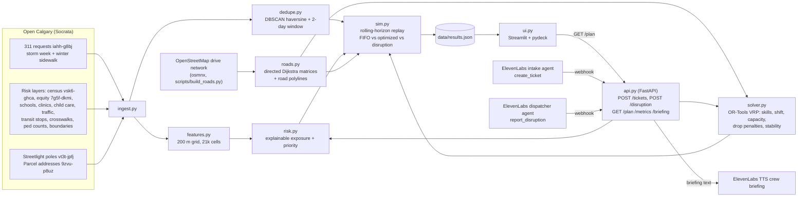

# SnowTech

Voice-native winter field operations for Calgary 311 snow and ice. Residents report icy
sidewalks, roads and pathways by voice. A solver decides which bylaw officer or Roads crew
goes where today, puts the riskiest ice first, and replans when crews call in sick or a second
snowfall lands.

The LLM handles language. The schedule comes from an OR-Tools solver, so it is feasible,
repeatable and auditable, and each ranking comes with its reasons.

## Architecture



There is no database. State lives in the API process and in files under `data/`.

## Road routing

Distances, drive times and the route lines on the map come from the real Calgary road network
(`civicsignal/roads.py`), not straight lines.

- **Network.** OpenStreetMap drivable roads for Calgary via `osmnx.graph_from_place("Calgary,
  Alberta, Canada", network_type="drive")`, largest strongly connected component: 36,449 nodes,
  83,379 directed edges. Edges are directed, so one-way streets are respected and the matrix is
  asymmetric. `scripts/build_roads.py` builds `data/roads/` (gitignored) in about 15 s from a
  cached download (about 35 s to download from OSM): a 5.1 MB npz (CSR graph plus edge geometry)
  and a 0.5 MB matrix cache for the historical stops and depots.
- **Speeds.** osmnx `add_edge_speeds` (posted `maxspeed`, else the mean for that road type) and
  `add_edge_travel_times`, times **one winter factor: 0.8 of free-flow speed**
  (`WINTER_SPEED_FACTOR`). There is no congestion or plowing-state model.
- **Paths.** `scipy.sparse.csgraph.dijkstra` on edge travel times: each leg is the fastest path,
  and the metres reported are the length of that same path. A new point (a voice ticket) costs
  one Dijkstra for its row and one on the reversed graph for its column.
- **Snapping.** Each point snaps to the nearest graph node (BallTree, haversine). The snap distance
  is added to metres and, at walking speed (5 km/h), to minutes. Historical tickets sit at
  community centrepoints, often in parks, so this is a walk from the curb.
- **Fallback.** Without `data/roads/` (a fresh clone), `roads.py` logs a warning and uses the old
  model, haversine x 1.3 at 30 km/h, so `pytest` still passes. `CIVICSIGNAL_ROADS=0` forces it.
- **Geometry.** Each crew route in `GET /plan` and in `data/results.json` has `geometry`: a
  road-following `[lon, lat]` polyline (GeoJSON order), depot -> stops -> depot, simplified to
  about 2 m. `path` is still the straight depot -> stops -> depot list. The dashboard draws
  `geometry`.

## Setup for teammates

### 1. Prerequisites

| Tool | Version | Install (macOS) |
|---|---|---|
| Python | 3.11 | python.org installer or `brew install python@3.11` |
| Node.js | 20 or newer | `brew install node` |
| cloudflared | any recent | `brew install cloudflared` (only needed for live voice calls) |

About 1 GB of free disk is needed for the venv, `node_modules` and the road network.

If you use the **python.org** installer on a Mac, run its certificate script once. Otherwise
every Open Calgary download fails with `CERTIFICATE_VERIFY_FAILED`:

```bash
"/Applications/Python 3.11/Install Certificates.command"
```

### 2. Clone and install

```bash
git clone -b civicSignal https://github.com/rizbikit1781/industry-hackathon-lab.git
cd industry-hackathon-lab/civicsignal
python3.11 -m venv .venv
.venv/bin/pip install -r requirements.txt
(cd web && npm install)
```

### 3. Create `.env` (never commit it)

Create `civicsignal/.env` with two lines:

```
ELEVENLABS_API_KEY=sk_...
CIVICSIGNAL_KEY=...
```

- `ELEVENLABS_API_KEY`: an ElevenLabs API key with these permissions: ElevenAgents (write),
  Voices (read), Models (read), Text to Speech. Make one at
  elevenlabs.io/app/settings/api-keys.
- `CIVICSIGNAL_KEY`: the shared webhook secret. The API rejects `POST /tickets` and
  `POST /disruption` without it, and the ElevenLabs agents send it.
  - **To use the team's existing voice agents,** ask Caelan for the value privately. It must match
    the secret stored on those agents. Don't paste it in chat or git.
  - **To create your own agents** on your own ElevenLabs account, generate a new one:
    `python3 -c "import secrets; print(secrets.token_urlsafe(32))"`. Then follow step 6, option B.

`.env` is in `.gitignore`. Check with `git check-ignore .env` before committing anything.

### 4. Rebuild the data that isn't in git

`data/results.json`, the storm-week tickets and the community features are committed, so the
replay page works right away. The live API also needs the risk layers, poles and road network:

```bash
.venv/bin/python scripts/pull_data.py     # ~2 min: Open Calgary layers + 200 m feature grid
.venv/bin/python scripts/build_roads.py   # ~1 min: OpenStreetMap roads -> data/roads/
.venv/bin/python -m pytest -q tests       # 21 tests should pass
```

Optional: `.venv/bin/python scripts/run_sim.py` (~3 min) regenerates `data/results.json`.
If you commit the regenerated file, the README numbers change too.

### 5. Run it (three terminals, all in `civicsignal/`)

```bash
# Terminal 1: engine API on :8000 (loads .env so the webhook secret is enforced)
set -a; . ./.env; set +a
.venv/bin/uvicorn civicsignal.api:app --host 127.0.0.1 --port 8000

# Terminal 2: web console on :3000
cd web && npm run dev                      # open http://127.0.0.1:3000

# Terminal 3: public tunnel, only needed for real voice calls
cloudflared tunnel --url http://127.0.0.1:8000
```

The first voice ticket in the ~10 s after the API starts can take up to 6 s, because the address
index is still loading. After that, tickets are inserted in about 1.5–2 s.

### 6. Connect the voice agents to your tunnel

The tunnel prints a `https://<random>.trycloudflare.com` URL. **It changes every time the tunnel
restarts.** Each time, point the agents' webhooks at the new URL:

- **Option A: the team's existing agents** (needs the team's `ELEVENLABS_API_KEY` and
  `CIVICSIGNAL_KEY`):
  ```bash
  .venv/bin/python scripts/setup_voice.py https://<random>.trycloudflare.com
  ```
  This updates the tools listed in `voice/agents.json`. Only one machine can own the tunnel at a
  time, so agree who runs the demo.
- **Option B: your own agents on your own ElevenLabs account.** Move the team IDs out of the way
  first, so the script creates new agents instead of trying to edit ones you can't access. Then
  run the script, and don't commit your `voice/agents.json`:
  ```bash
  mv voice/agents.json voice/agents.team.json
  .venv/bin/python scripts/setup_voice.py https://<random>.trycloudflare.com
  ```

The script prints a talk-to link for each agent. The web console's voice panel ("Talk to SnowTech 311") uses the intake
agent ID from `voice/agents.json`.

### 7. Demo checklist

1. Restart the API right before presenting. Its state is in memory, so a restart clears test
   tickets and resets crews.
2. Start the tunnel, run `setup_voice.py` with the new URL, then make one test call.
3. Open http://127.0.0.1:3000 and check that **Live ops** shows routes and **Storm-week replay** loads.
4. Keep a backup: the Streamlit dashboard (`.venv/bin/streamlit run civicsignal/ui.py`, port
   8501) and a recorded video.

### Troubleshooting

| Symptom | Fix |
|---|---|
| `CERTIFICATE_VERIFY_FAILED` | Run the Python certificate script (step 1). |
| Web console says "API not reachable" | Terminal 1 isn't running, or it's not on port 8000. |
| Voice agent says it couldn't find the location | Use a numbered intersection with its quadrant, e.g. "17 Ave SW & 37 St SW". |
| Voice calls stopped creating tickets | The tunnel restarted with a new URL. Rerun `setup_voice.py` (step 6). |
| `401 bad or missing X-CivicSignal-Key` | `.env` wasn't loaded in Terminal 1, or the key doesn't match the agents' secret. |
| Web pages return 404 chunks after `npm run build` | Building breaks a running dev server. Restart `npm run dev`. |
| Routes are straight lines | `data/roads/` is missing. Run `scripts/build_roads.py` and restart the API. |

### Direct API calls

Example voice-ticket call (what the ElevenLabs webhook sends). Load `.env` first:

```bash
set -a; . ./.env; set +a
curl -X POST localhost:8000/tickets -H 'Content-Type: application/json' \
  -H "X-CivicSignal-Key: $CIVICSIGNAL_KEY" \
  -d '{"service_name":"sidewalk","intersection":"17 Ave SW & 37 St SW","description":"icy sidewalk by bus stop","hazard_notes":"walker user, bus stop"}'
curl -X POST localhost:8000/disruption -H 'Content-Type: application/json' \
  -H "X-CivicSignal-Key: $CIVICSIGNAL_KEY" -d '{"crews_out":3}'
curl localhost:8000/briefing/B01
```

API environment variables: `CIVICSIGNAL_DAY` (replay morning, default `2025-11-26`),
`CIVICSIGNAL_KEY` (if set, POSTs need header `X-CivicSignal-Key`), `CIVICSIGNAL_SOLVE_S` (default 2),
`CIVICSIGNAL_INSERT_S` (default 1.5), `CIVICSIGNAL_RESERVE` (tickets per crew held back for
same-day reports, default 2). Voice agent prompts and tool JSON are in `voice/agent.md`.

## Frontend

A Next.js console in `web/` replaces the Streamlit dashboard for the demo: a live ops map
(`/`) that polls the API and shows voice tickets arriving within seconds, disruption buttons, and the
ElevenLabs voice panel (`@elevenlabs/react` over WebRTC, with a real mic mute); a storm-week replay (`/replay`) comparing the three policies; and a plain-words
"How it works" page (`/about`).

Run steps are in "Setup for teammates" above (step 5).

The browser only reads the API through a Next.js proxy (`/api/*`). Disruptions go through a server
route that adds `X-CivicSignal-Key` from `.env`, so the key never reaches the client. See `web/README.md`.

## Data (all from data.calgary.ca, pulled Oct 3, 2026)

| Use | Dataset | Rows pulled |
|---|---|---|
| Storm-week tickets, Nov 18 - Dec 1, 2025 (7 warm-start days + storm week) | 311 Service Requests `iahh-g8bj` | 3,157 (2,845 in Nov 25 - Dec 1) |
| Dedupe validation: sidewalk snow/ice, Nov 2025 - Mar 2026 | `iahh-g8bj` | 11,680 |
| Nearest streetlight pole | Streetlight Poles `vt3t-jpfj` | 107,461 |
| Seniors / 75+ / children shares | Civic Census by Community, Age & Gender `vsk6-ghca` (2019) | 2,592 |
| Low-income seniors, no-English, transit-to-work, seniors | Calgary Equity Index `7g5f-dkmi` (2021, 113 Community Service Areas) | 2,034 |
| School proximity | Schools `fd9t-tdn2` | 506 |
| Hospital / clinic proximity | Community Services `x34e-bcjz` (5 Hospital + 9 PHS Clinic) | 211 |
| Child-care proximity | Child Care Information `qdxh-qngy`, geocoded via Parcel Address `9zvu-p8uz` | 1,179 of 1,415 active programs |
| Road traffic exposure | Traffic Volumes 2024 `cauu-7hnw` | 334 segments |
| Pedestrian proxy | Transit Stops `muzh-c9qc` (active) + Crosswalks `hxgg-rpad` | 6,213 + 4,215 |
| Proxy validation | Bike & Ped Counts `pede-tz7g` + locations `uwis-xpm2` | 13 sites with pedestrian counts |
| Community polygons, sectors, comm_code fallback | Community District Boundaries `surr-xmvs` | 313 |
| Intersection geocoding | derived from the crosswalk inventory `hxgg-rpad` | 4,076 intersections |

**Hand-listed (not open data):** `data/seniors_residences.csv`, 17 Calgary continuing-care and
seniors' residences (Carewest, Bethany, Brenda Strafford, AgeCare, Intercare, Father Lacombe), each
with a source URL (operator or AHS FindHealth page). No Calgary open layer for these exists. 12 of
17 were geocoded by exact match to the City Parcel Address layer. The other 5 (George Boyack,
Colonel Belcher, Royal Park, Rouleau Manor, Glenmore Park) did not match and are left out of the
feature.

## Results (actual output of `scripts/run_sim.py`)

**Method change (Oct 3, 2026).** All km and drive times below are now **real road km** on the OSM
network (see Road routing). Earlier versions of this README used straight-line distance x 1.3 at
30 km/h, which reported FIFO 7,253 km and SnowTech 2,417 km. Road km are about 18-19% higher
for both policies. The FIFO baseline uses the same road matrix for crew choice, sequencing and
km, so the comparison stays like for like. The relative saving is unchanged at -67%. Coverage
numbers moved by 1-2 points because drive times changed which stops fit in a shift.

**Capacity calibration.** Real median daily closures in the storm week were bylaw 53/day and
roads+pathway 164/day. The replay uses 3 bylaw crews x 20 tickets and 14 Roads crews x 12 tickets,
so every policy gets 228 tickets/day. Real arrivals averaged about 400/day, so the backlog grows
under every policy, as it did in reality.

**Three policies.** Same crews, same capacity, 2,825 storm-week tickets with a location. 708 of
them are high-risk (top exposure quartile within each crew type).

| Metric | FIFO (oldest first) | SnowTech | SnowTech + disruption |
|---|---|---|---|
| High-risk tickets served within 48 h | **13.4%** | **42.9%** | **42.1%** |
| All tickets served within 48 h | 10.8% | 26.7% | 25.0% |
| High-risk tickets served in the week | 47.6% | 65.0% | 65.5% |
| Low-risk (bottom quartile) served in the week | 57.1% | 35.4% | 33.5% |
| p90 days to service (unserved censored at Dec 2) | 5 | 6 | 6 |
| p90 days, high-risk tickets | 5 | 5 | 5 |
| Median days to service | 3 | 2 | 2 |
| Tickets served (incl. warm start) | 1,596 | 1,596 | 1,528 |
| Total road km driven | **8,652** | **2,848 (-67%)** | 2,762 |
| Road km per ticket | 5.42 | 1.78 | 1.81 |
| Crew stops (one stop = up to 4 bylaw / 3 roads tickets at one location) | 1,596 | 527 | 505 |
| Jobs moved per replan | n/a | n/a | 37.5 |

The disruption run serves slightly more high-risk tickets over the week than the undisrupted run
(65.5% vs 65.0%). That is solver variance across 2 s time-limited solves, not a benefit of losing
crews: it serves 68 fewer tickets in total.

**Disruption replans** (stability penalty on):
- Nov 27, 30% of crews out (B01, R01-R04) after the morning plan. 34 of 71 planned stops moved,
  re-solved in 4.0 s. High-risk tickets planned went from 54 to 50.
- Dec 1, the day's 478 real arrivals land mid-day as a surge. 41 of 79 stops moved in 4.0 s.
  High-risk tickets planned went from 22 to 76.

**What did not improve, stated plainly.** SnowTech beats FIFO on high-risk coverage within
48 h (+30 points), all-ticket coverage within 48 h, median wait, and road km (-67%). It is **worse
on p90 days to service (6 vs 5)** and serves **fewer low-risk tickets (35% vs 57%)**. That is the
cost of triage when capacity is about half of demand. FIFO bounds the oldest wait and
SnowTech does not. The age term in the priority limits starvation but does not remove it. We
did not change the metric. We chose the policy weights (below) and report this trade-off.

**Policy-weight sweep** (the software tuning its own rule). These are full-week replays with
1 s solves. The default is row 3.

| exposure w | report-pressure w | age w | high-risk <=48 h | all <=48 h | high-risk served | low-risk served | p90 days | km |
|---|---|---|---|---|---|---|---|---|
| 1 | 1.0 | 1.0 | 20.9% | 27.9% | 48.3% | 50.6% | 6 | 2,928 |
| 2 | 1.0 | 1.0 | 29.7% | 27.5% | 55.5% | 42.9% | 6 | 2,865 |
| **3** | **0.5** | **1.0** | **43.2%** | **26.6%** | **65.3%** | **36.8%** | **6** | **2,887** |
| 4 | 0.5 | 0.5 | 53.7% | 30.9% | 73.0% | 34.0% | 6 | 2,837 |

Row 4 scores higher on coverage. We kept row 3 so that age keeps full weight as an
anti-starvation term. This is a policy choice for a supervisor. Note that the weights were
chosen on the same storm week they are evaluated on. There is no held-out week.

**Lambda sweep, day 1 (Nov 25).** Lambda is the metres of driving one unit of priority is worth.

| lambda | road km | tickets planned | high-risk planned |
|---|---|---|---|
| 2,000 | 18.2 | 36 | 10 |
| 5,000 | 84.5 | 125 | 29 |
| 10,000 | 259.7 | 220 | 67 |
| 25,000 | 318.9 | 228 | 69 |
| 50,000 | 383.3 | 228 | 85 |
| 100,000 (default) | 439.6 | 228 | 97 |
| 250,000 | 468.8 | 228 | 88 |

**Feature-weight presets.** Jaccard overlap of each preset's top quartile with the default top
quartile: seniors_first 0.685, children_first 0.545, mobility_first 0.828, equity_first 0.636,
places_only 0.408, people_only 0.621. The weights are policy inputs and they change who gets
served.

### Validation

**Duplicate detection vs City labels** (`dedupe.validate`, sidewalk snow/ice Nov 2025 - Mar 2026,
11,680 tickets, 66 labelled `Duplicate (Closed)`). DBSCAN with a 50 m radius and a 2-day window:

| recall | precision | base rate | lift over random |
|---|---|---|---|
| **80.3%** (53/66) | **0.58%** (53/9,114) | 0.57% | 1.03x |

This is a **negative result**, and the cause is in the data. 100% of these public tickets are
geolocated to the **community centrepoint** (`location_type = 'Community Centrepoint'`). The
11,680 tickets sit at only 269 distinct points, so "within 50 m" just means "same community".
Spatial dedupe cannot tell true duplicates apart on the public feed. With 1-day and same-day
windows, precision stays at 0.55-0.61%. The module does work on real coordinates: unit tests
cover this, and live voice tickets carry exact lat/lon, where `POST /tickets` merges a repeat
report within 50 m. A real precision number needs the City's address-level data. Because of
this, the sim does **not** claim "duplicate visits avoided". It reports stops consolidated: tickets
at the same location served in one stop (1,596 tickets in 527 stops vs FIFO's 1,596 stops).

**Pedestrian proxy vs real counts.** Transit stops within 300 m plus crosswalks within 150 m,
compared with average daily pedestrian counts at the City count sites: **Spearman 0.16 (n = 12,
p = 0.62)**. Crosswalks alone give 0.41 and transit alone -0.16. **The proxy is not validated.**
The pedestrian counters are mostly on river pathways (Peace Bridge, Bow River Pathway, Glenmore),
where street furniture says little about foot traffic. (Of 26 count locations, only 13 count
pedestrians, and one of those has no location row.) The proxy stays in the model at weight 0.75.
A supervisor can set it to 0.

**Feature smoke checks.**
- A point beside Foothills Medical Centre (51.0650, -114.1330) scores hospital proximity 0.66
  (Foothills is about 120 m away; exp(-d/400 m)).
- Varsity (23.5% aged 65+ in the 2019 census) is at the 90th percentile for 65+ share and the 95th
  for 75+.
- Southwood (12.7% 65+, 6.1% 75+) is only at the 46th and 67th percentiles. It is not
  seniors-heavy in the 2019 data, so the example in the plan did not hold.

**Ingest checks.** 3,157 rows. All three service names are present (sidewalk 1,349, roads 1,091,
pathway 405 in the storm week). 22 rows have no lat/lon or comm_code (20 in the storm week) and
are dropped from the replay. Census join coverage is **98.3%** of storm-week tickets and 95.2% of
their communities. The misses are communities built after 2019 (Moraine, Glacier Ridge, Alpine
Park); they get the neutral city median (0.5).

**API timing (road routing).** Seven `POST /tickets` calls in a row (intersection, address and
lat/lon; sidewalk, road and pathway) each returned HTTP 200 in **1.5-1.7 s**. That covers geocode,
features, dedupe check, road-matrix row and column for the new point, OR-Tools re-insert (1.5 s
limit), and nearest pole. In the first ~9 s after startup, while the address index loads in a
background thread, one roads ticket took 6.2 s; after that the worst case was 1.7 s. `GET /plan`
with road polylines takes 0.2 s, then 0.02 s from the per-route cache. Example result: a sidewalk
report at 51.0607, -114.1035 (beside Bethany Calgary) ranked #7 of the open locations ("high 65+
share, high 75+ share, near seniors' residence"). It was inserted as stop 5 (position 4) on bylaw
crew B01, **+11.6 min** of road time. A second report 5 m away came
back as `duplicate_of` the first. `POST /disruption {"crews_out":5}` re-solved in about 2.5-6 s.

**Tests.** `pytest tests/` gives 21 passed. Road tests: a one-way triangle gives an asymmetric
matrix (B to A goes round via C) with the winter factor applied, the polyline follows the directed
edges and ends at the stops, the haversine fallback works with no road cache, and on the real
Calgary network road metres are at least the straight line and polylines start and end at the
stops. Dedupe merges a pair 30 m / 1 day apart, and does not
merge pairs 500 m apart, 5 days apart, or of different services. The solver respects ticket
capacity, shift minutes and skills. `insert_job` returns a crew, a position and a positive delta.
There are also feature smoke tests and an API test (insertion under 5 s, duplicate, 422 with no
location, disruption, briefing).

**Dashboard.** `streamlit run civicsignal/ui.py` renders with no exceptions for all 3 policies x
7 days and in live-API mode (checked with Streamlit's AppTest).

## Design notes and deviations from the plan

- **Community-centrepoint locations.** Historical tickets carry no address. Each one gets its
  community's *area-average* exposure (the mean of grid cells inside the community polygon). A
  live voice ticket with a real lat/lon gets its own 200 m cell.
- **Jobs.** Open tickets at one location and of one service are bundled oldest-first into stops of
  at most 4 bylaw or 3 Roads tickets. Service time is 10 min per bylaw inspection and 20 min per
  Roads ticket.
- **Solver size.** Each skill is solved separately, which guarantees exact skill matching. Each
  skill considers only its highest-value jobs, up to 2x its daily ticket capacity: about 100-250
  nodes. Settings are guided local search with 2 s per skill per day (`--time-limit`). The full
  replay runs in about 30-40 s per optimized policy and 160 s with both sweeps. No district
  partitioning was needed.
- **Depots.** District-office locations are not published. Each crew starts at the centroid of its
  city sector (from the boundaries layer), assigned in order of ticket volume. This is an
  assumption.
- **Equity Index** is published per Community Service Area (113 areas), not per community. It is
  joined by point-in-polygon. The value is a percentile of the area's `value`.
- **High-risk** means the top quartile of static exposure within each crew type. It is fixed before
  any policy runs and excludes age and report count, so no policy can game it.
- **"Within 48 h"** means served by the end of the day after the request day. Dates are day-only.
- **Disruption in the sim**: 30% of crews out on day 3 after the morning plan, and a mid-day surge on
  day 7 (Dec 1, the real second bump). In the API, the surge loads the next day's real arrivals.
- **Same-day reserve**: the API's morning plan holds back 2 tickets per crew, so a voice report
  can be inserted without dropping a planned stop. The replay does not use this reserve.
- **Not built**: plan step 8 beyond `voice/agent.md`. That means no `scripts/briefing.py` TTS (it
  needs `ELEVENLABS_API_KEY`), no tunnel, and the agents have not been tested on ElevenLabs.
  `GET /briefing/{crew}` produces the text.

## Honesty notes

- A ticket's closure date is not the date the ice was cleared. Bylaw closures include notice and
  compliance steps. We compare policies under the same calibrated capacity and do not claim to beat
  the City's real times.
- The FIFO baseline is our model of a no-triage queue, not the City's real dispatch, which is not
  public.
- Risk weights, service times, crew counts per ticket and depots are assumptions a supervisor would
  tune. The model ranks exposure (who is likely to be on that ice). It does not predict falls.
- The duplicate detector and the pedestrian proxy failed validation on public data (see above).
- Road km and minutes use OSM free-flow speeds times one assumed winter factor (0.8). There is no
  traffic, no turn penalties, no plow-state or road-closure model, and OSM speed tags are partly
  imputed by road type. Historical stops are community centrepoints, so per-stop distances are
  approximate even on real roads.
