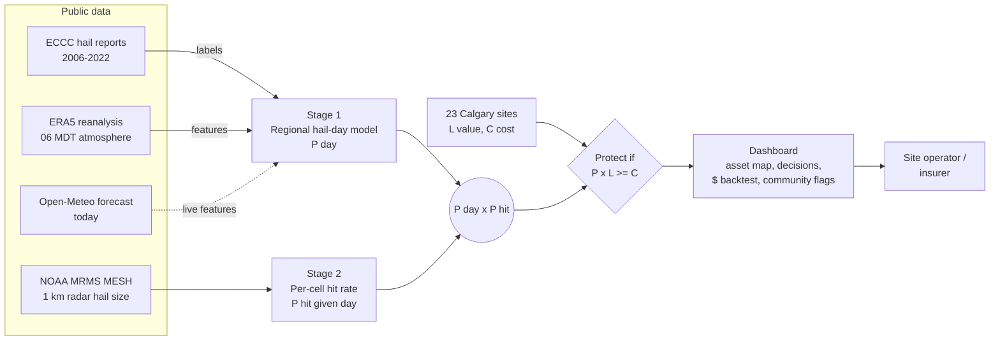
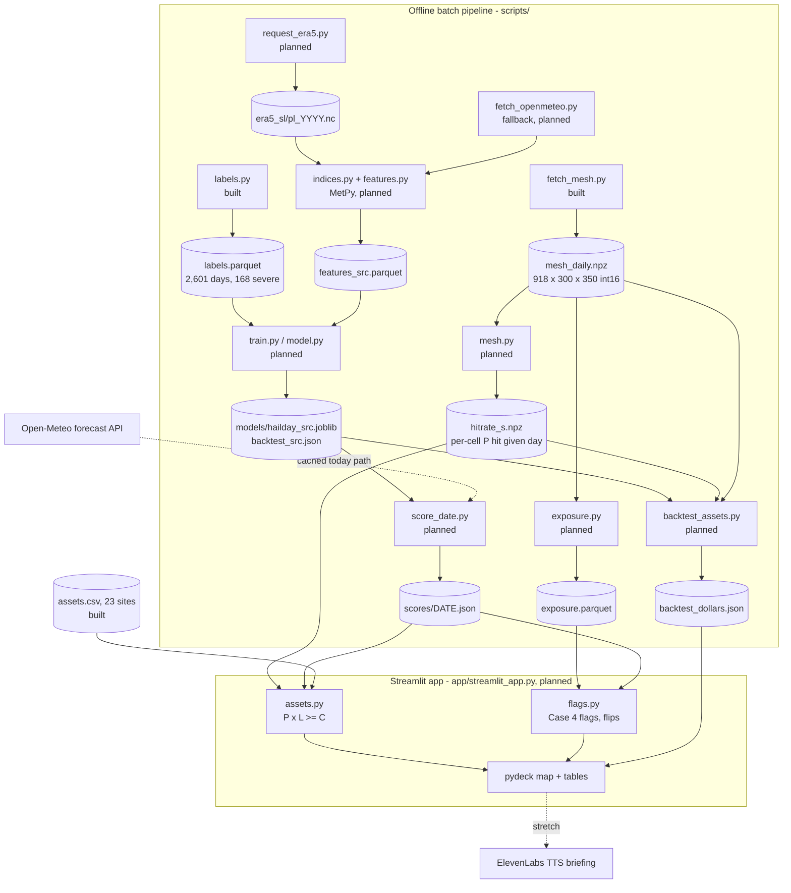
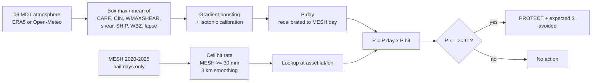
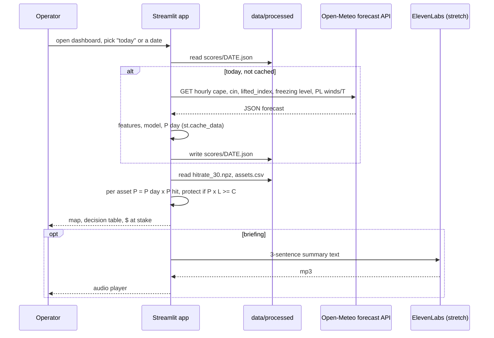
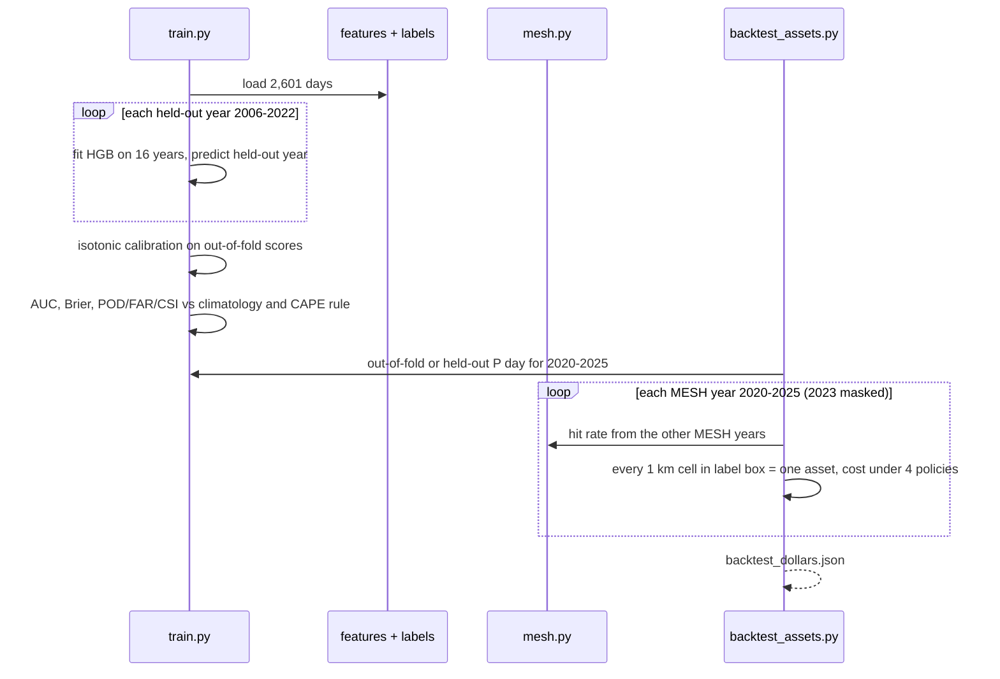
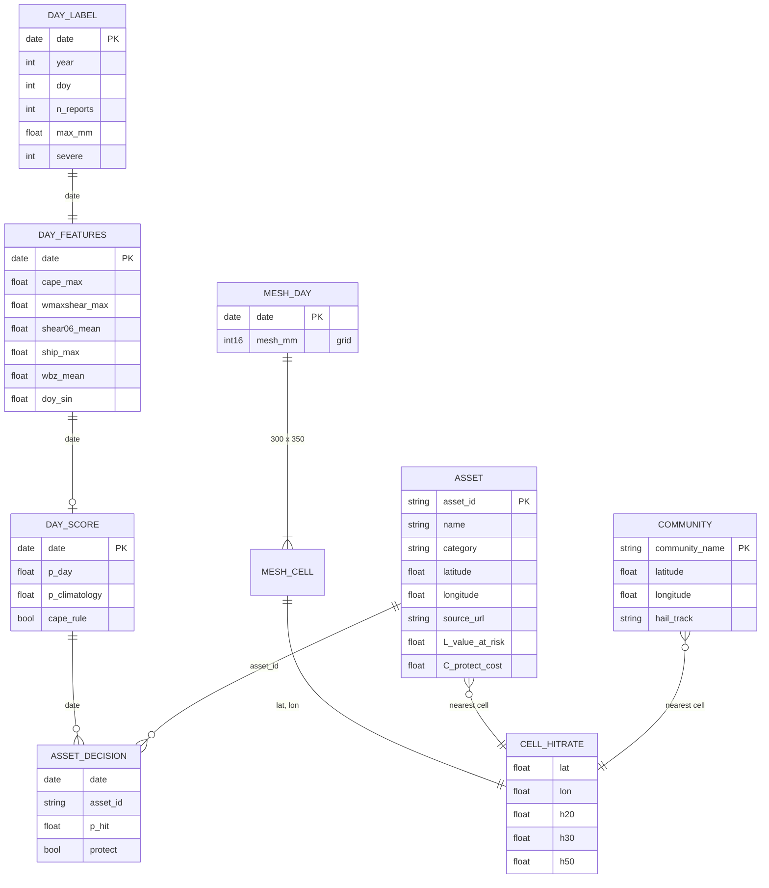
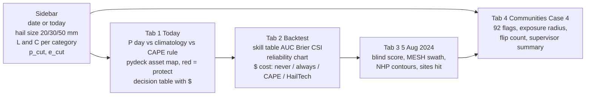

# HailTech: Software Design Document

IEEE YP Industry Hackathon, Calgary. Option B, Software Case 4. Submission deadline Sun 4 Oct 2026, 12:00 PM MDT.

Status legend used throughout: **built** = code and output exist in this repo; **planned** = designed here, not yet implemented.

---

## 1. Introduction

**Purpose (problem statement).** Outdoor assets in the Calgary region (vehicle inventory, parked fleets, RVs, greenhouse glass, solar panels, light-rail vehicles) are exposed to severe hail several days a summer. Protection exists (move vehicles under cover, deploy hail nets, stow trackers, shelter trains), but it costs labour and lost use, so operators need to know on the morning of the day whether it is worth doing *at their site*. The 5 Aug 2024 storm caused about CAD 3.3 B in insured losses; the 13 Jun 2020 storm about CAD 1.3 B. This document defines the design of HailTech, a system that issues a 6 AM per-asset probability of damaging hail and a protect / do-not-protect decision.

**Scope.**

| In scope | Out of scope (non-goals / roadmap) |
|---|---|
| Day-ahead (06 MDT issue) regional severe-hail probability for the Calgary label box | Radar nowcasting (ECCC publishes no open volumetric radar) |
| Per-asset hit probability from radar hail climatology | Per-asset ML trained on MESH alone |
| Cost-loss protect decision per asset | Production deployment, auth, multi-tenant service |
| Dollar backtest 2020–2025 and blind 5 Aug 2024 case | Weather perils other than hail (product roadmap) |
| Case 4 community flag view (92 communities, cutoff slider, flip count) | Real customer valuations (L and C are user-set assumptions) |

**Who this is for.** Operators of outdoor asset sites: auto dealers, rental and airport parking lots, fleet lots, RV storage, a nursery/greenhouse, a solar farm, and transit (two outdoor LRT yards). On the commercial side the buyer is the insurer, who benefits from fewer claims and can bundle HailTech alerts into commercial auto and property policies. Readers of this document: hackathon judges and the team.

**References.** `hackathon-strategy.md` (v3, predates the asset pivot); `hail-sme-report.md` (physics, thresholds, ERA5 request); the MVP plan (step 7a); data sources are cited in the lineage table (§5); hackathon `DESIGN-DOC-TEMPLATE.md` and `JUDGING_RUBRIC.md`.

---

## 2. System Overview

**System description.** HailTech is a batch data pipeline plus a read-only dashboard. Offline scripts turn three public datasets into a trained regional model, a per-cell hail climatology grid and precomputed scores. The dashboard multiplies the two probabilities for each asset, applies a cost-loss rule and shows the decision, the dollar backtest and the community flag view.

The core equation:

```
P(asset hit today) = P(regional hail day | 06 MDT atmosphere)  ×  P(asset hit | regional hail day)
                     \_____ Stage 1: ERA5 -> classifier ____/     \___ Stage 2: MESH climatology ___/
protect if P(asset hit today) × L ≥ C          (L = value at risk, C = cost of protecting)
```

**Design goals.**
1. Honest skill: every number is out-of-sample (leave-one-year-out) and compared with two baselines.
2. Explainable: every model input is a named meteorological quantity (CAPE, shear, freezing level).
3. Cheap to run: free public data, a laptop, no GPU, no paid API in the core path.
4. Demo-safe: the app reads precomputed files, so it cannot fail on a slow API during the pitch.
5. Decision, not display: output is a protect / do-not-protect action per asset with a dollar consequence.

**Architecture summary.** Single-repo Python monolith in two halves: an offline batch pipeline (scripts writing files) and a stateless Streamlit app reading them. Files are the contract between the halves; there is no server or database.

**System context diagram (the 10-second view).**



---

## 3. Architectural Design

**System architecture diagram (components and files).**



**Component breakdown.**

| Component | Status | Responsibility |
|---|---|---|
| `hailday/config.py` | built | Boxes, years, thresholds, URLs, outage window. Constants only. |
| `hailday/labels.py` | built | ICHD CSV → one row per local MDT day, label box, May–Sep 2006–2022. |
| `scripts/fetch_mesh.py` | built | Download MRMS MESH daily max, crop to feature box, write int16 cube. |
| `data/assets.csv` | built | 23 real Calgary sites with coordinates and source URL per row. |
| `scripts/request_era5.py`, `hailday/era5.py`, `indices.py` | planned | CDS request; NetCDF → per-day convective indices via MetPy. |
| `scripts/fetch_openmeteo.py`, `hailday/openmeteo.py` | planned | Fallback surface features; live "today" forecast fetch. |
| `hailday/features.py` | planned | Shared feature schema across sources; joins labels. |
| `hailday/model.py`, `metrics.py`, `scripts/train.py` | planned | Baselines, gradient boosting, LOYO CV, isotonic calibration, metrics. |
| `hailday/mesh.py` | planned | Per-cell conditional hit rate with ~3 km Gaussian smoothing. |
| `hailday/assets.py` | planned | Combine stages, cost-loss decision, per-asset backtest. |
| `hailday/exposure.py`, `flags.py` | planned | Community exposure from MESH frequency; Case 4 flag rule and flip count. |
| `scripts/score_date.py` | planned | Score one date (historical or today), cache JSON. |
| `app/streamlit_app.py` | planned | Dashboard; reads files only. |

**Data flow: input → decision → output.**



**Control flow: morning briefing sequence (planned).**



**Training and backtest sequence (offline).**



---

## 4. Detailed Backend Design

### 4.1 Labels (built)
- **Inputs:** `data/raw/hail.csv` (ICHD v1.0.0, 7,000 rows, UTC timestamps).
- **Logic:** parse UTC, convert to `America/Edmonton`, take the local date (00–06 UTC reports belong to the previous local day; tested). Keep `Province Code == AB` inside the label box 50.4–51.7 N, 113.2–114.9 W. Aggregate per day: `n_reports`, `max_mm`, `severe = max_mm ≥ 20`. Reindex to every May–Sep day 2006–2022 so negatives exist. 2005 is dropped (one severe day, incomplete reporting).
- **Output:** `labels.parquet` (`date, year, doy, n_reports, max_mm, severe`): 2,601 days, 168 severe (6.5 %).
- **Errors:** blank diameters coerce to NaN and never count as severe.

### 4.2 Features (planned)
- **Primary (ERA5, 12 UTC = 06 MDT):** box max and mean over the feature box 49.5–52.5 N, 112.0–115.5 W (13 × 15 points at 0.25°) of native `cape`, `cin`, `k_index`, `total_totals_index`, `zero_degree_level`, `tcwv`, 2 m Td, plus MetPy-derived MU/ML CAPE, 0–6 km and 925–500 hPa shear, WMAXSHEAR = √(2·MUCAPE) × shear₀₋₆, SHIP, 700–500 hPa lapse rate, wet-bulb-zero height, mid-level dewpoint depression, 500/700 hPa u/v wind; day-of-year sin/cos. Never `year` (report rates vary about 8× between years). Pressure levels below surface pressure (~890 hPa at Calgary) are masked.
- **Fallback (Open-Meteo archive):** surface variables only (no CAPE, no pressure levels) at a 3 × 3 point grid, plus antecedent rain and overnight dewpoint. Same schema keys, so `train.py` is source-agnostic.
- **Live (Open-Meteo forecast):** `cape`, `convective_inhibition`, `lifted_index`, `freezing_level_height` and pressure-level T/wind, mapped to ERA5 feature names; fields with no equivalent are NaN, which the model accepts natively.

### 4.3 Stage 1: regional hail-day classifier (planned)
- **Target:** `severe` (ICHD, ≥ 20 mm, label box, local day).
- **Model:** `sklearn.ensemble.HistGradientBoostingClassifier` (shallow trees, early stopping, class weighting for the 6.5 % positive rate), then isotonic calibration fitted on out-of-fold scores so the output is a probability.
- **Validation:** leave-one-year-out over 17 seasons. Random splits are not used because days within a season are correlated.
- **Baselines:** (a) monthly climatology from training years; (b) single-index rule, ERA5 CAPE ≥ threshold chosen on training folds (12 MDT dewpoint for the fallback source).
- **Metrics:** AUC, Brier score, POD / FAR / CSI at the CSI-maximising cutoff, 10-bin reliability diagram. Permutation importance for explanation.
- **Why gradient boosting:** 168 positives cannot support a deep model; trees re-threshold indices such as SHIP that are calibrated for the US, capture non-monotone CIN, and tolerate ERA5's low CAPE bias because only rank order matters to a split.

### 4.4 Stage 2: per-cell conditional hit rate (planned; input built)
- **Input:** `mesh_daily.npz`, 918 local days (May–Sep 2020–2025), 300 × 350 cells at 0.01°, values in mm; `-1` covered no hail, `-3` no coverage, `-9` missing. 915/918 files downloaded, 797 valid days after the 2023 outage mask (5 Jun–28 Nov 2023).
- **Regional hail day (MESH definition):** any label-box cell ≥ 20 mm.
- **Hit rate:** for each cell, `h_s(cell) = #(hail days with MESH ≥ s at cell) / #(valid hail days)`, s ∈ {20, 30, 50} mm, 30 mm the default. Counts are smoothed with a Gaussian kernel σ ≈ 3 cells (~3 km) before dividing, so sparse cells borrow strength from neighbours.
- **Why 30 mm:** MESH runs high against ground reports, so 30 mm MESH is used as a proxy for damaging (~20 mm+) ground hail; 20 and 50 mm are reported as sensitivity.
- **Leakage control:** in the backtest, the hit rate for year *y* is built from the other MESH years only.

### 4.5 Combining the stages and the event-definition mismatch
Stage 1 predicts an ICHD-defined day (a human reported ≥ 20 mm hail in the box); Stage 2 conditions on a MESH-defined day (radar estimated ≥ 20 mm anywhere in the box). These are different events: MESH days are more frequent (radar sees rural storms that no one reports, and MESH runs high). Multiplying the raw Stage 1 output by Stage 2 would therefore be inconsistent.

Handling (planned): Stage 1's out-of-fold score is recalibrated to the MESH day definition on the overlapping years where both features and MESH exist (2020–2022, plus 2024–2025 where ERA5 features exist but ICHD does not). Because this is only ~5 seasons, the recalibration is a low-capacity monotone map (Platt / logistic on the score, not a second isotonic fit). The product `P_day_MESH × h_30` is then a consistent probability that MESH ≥ 30 mm at the asset. The ICHD-trained model supplies 17 years of physics; MESH supplies the event definition the assets are scored against. The skill table reports both the ICHD-target metrics and the MESH-target metrics.

### 4.6 Decision layer (planned)
- **Rule:** protect asset *a* on day *d* if `P(a, d) × L_a ≥ C_a` (classical cost-loss; equivalent to protecting when P ≥ C/L).
- **Inputs:** `L` (value at risk) and `C` (protection cost) per asset, user-set assumptions with category defaults, editable in the sidebar. They are labelled as assumptions everywhere.
- **Output per asset:** P, threshold C/L, decision, expected loss avoided `P × L − C`.

### 4.7 Dollar backtest (planned)
- Every 1 km MESH cell inside the label box is treated as an asset with the same L and C (about 22,000 cells × ~5 valid seasons), so the result is a statistic over the region, not over 23 hand-picked sites.
- Truth: MESH ≥ 30 mm at the cell on that day.
- Policies: **never** (cost = Σ hits × L), **always** (cost = days × C), **CAPE rule** (protect when the CAPE baseline fires), **HailTech** (cost-loss rule). Cost under a policy = protected days × C + unprotected hits × L.
- Reported: total cost per policy, savings vs never and vs always, and the value score `(cost_never − cost_policy) / (cost_never − cost_perfect)`, swept over C/L.

### 4.8 Validation case: 5 Aug 2024 (planned; MESH values measured)
Scored blind: 2024 is outside ICHD and outside the Stage 1 training years. MESH at the sites: NE dealers 44 mm, airport lots 42 mm, RV storage 48 mm, greenhouse 47 mm, south sites ~0. These are cross-checked against the Northern Hail Project damage contours (`NHP_August2024_DamageContours`). The demo shows the 06 MDT probability, the baselines' verdicts and which sites the rule would have protected.

### 4.9 Community flag view, Case 4 (planned)
- **Exposure:** frequency of MESH ≥ 30 mm per community centroid (92 communities from the case CSV), scaled 0–1. Called historical exposure, never forecast.
- **Rule:** flag when `P_day ≥ p_cut` and `exposure ≥ e_cut`. Baselines from the case: downtown only; flag all when P is high.
- **Cutoff loop:** sliders move `p_cut` / `e_cut`; the app shows the flip count (symmetric difference vs the previous state, held in `st.session_state`) and a ten-line supervisor summary.

**State management.** The pipeline is stateless between runs; each script reads its inputs from files and writes outputs atomically. The app holds only UI state (slider positions, previous flag set) in `st.session_state` and caches today's forecast with `st.cache_data`.

---

## 5. Data and Storage Design

There is no database. Files in `data/processed/` and `models/` are the schema; raw downloads in `data/raw/` are gitignored and reproducible from scripts.



Built files: `labels.parquet` (2,601 rows); `mesh_daily.npz` (`dates`, `mesh[918,300,350]` int16 mm, `lats`, `lons`; ~190 MB uncompressed); `assets.csv` (23 sites, with `source_url` and `coord_method` per row; L and C columns planned); `neighbourhoods_hail_scenario.csv` (92 communities, copied from the case). Planned: `features_{era5,openmeteo}.parquet`, `models/hailday_{src}.joblib`, `backtest_{src}.json`, `hitrate_{20,30,50}.npz`, `exposure.parquet`, `scores/<date>.json`, `backtest_dollars.json`.

### Data lineage

| Source | Licence | Resolution | Years used | Access | Status |
|---|---|---|---|---|---|
| ECCC/NHP Integrated Canadian Hail Database v1.0.0 | Open, cite DOI 10.5281/zenodo.8015924 | point reports | 2006–2022, May–Sep | Zenodo HTTPS, no key | built |
| ERA5 single + pressure levels | Copernicus licence (free, attribution) | 0.25° (~25 km), hourly; 12 UTC used | 2005–2025 requested | Copernicus CDS API, token in `~/.cdsapirc` | planned (request) |
| Open-Meteo historical archive | CC BY 4.0 | ~11 km (ERA5-Land/ERA5), hourly | 2006–2025 | HTTPS, no key | planned (fallback) |
| Open-Meteo forecast | CC BY 4.0 | model-dependent, hourly | today | HTTPS, no key | planned |
| NOAA MRMS MESH Max 1440 min | Public domain (US Gov) | 0.01° (~1 km), daily max | 2020–2025, May–Sep (2023 masked) | AWS `noaa-mrms-pds` anonymous; 2020 from Iowa State mtarchive | built (915/918 days) |
| NHP August 2024 damage contours | CC BY-NC 4.0 | polygons | 5 Aug 2024 | NHP download | planned (validation) |
| Open Calgary business licences | Open Government Licence – City of Calgary | point | current | Socrata API | built (site coords) |
| OpenStreetMap | ODbL | point/polygon | current | Overpass / web | built (site coords) |
| Case 4 communities CSV | hackathon-provided | centroid | n/a | repo | built |

---

## 6. External Interfaces

| Interface | Protocol | Failure handling |
|---|---|---|
| Zenodo ICHD | HTTPS GET, CSV | one-time download, cached |
| Copernicus CDS | `cdsapi` queued jobs, NetCDF | split by year; Open-Meteo fallback runs until ERA5 lands |
| NOAA MRMS (AWS S3) | anonymous HTTPS, GRIB2.gz | gzip magic-byte check; Iowa State fallback; missing day = `-9` |
| Iowa State mtarchive (2020) | HTTPS listing + GET | earliest file per day; ~12 UTC window offset noted |
| Open-Meteo archive / forecast | REST, JSON | cached per point-year / per date; app falls back to last cached score |
| ElevenLabs TTS (stretch) | REST, key in env var | optional; app works without it |

All interfaces are pull-only, HTTPS, batch. Eight worker threads parallelise the MESH download.

---

## 7. Security Considerations

- **Authentication:** none in the app; it is a local or demo deployment with public data only.
- **Secrets:** no secrets in the repo. The CDS token lives only in `~/.cdsapirc` (outside the repo). The optional ElevenLabs key is read from an environment variable; `.env` is gitignored and `.env.example` holds placeholders only. The submission repo is public, so this is enforced by `.gitignore` and a pre-submission `git grep` for key patterns.
- **Authorization:** not applicable for the MVP (single user, read-only files). A product version would scope each customer to their own asset list.
- **Data protection:** all inputs are public. Asset coordinates come from public business licences and OSM; L and C are assumptions, not customer data. Raw data is not committed (size and licence reasons); scripts reproduce it. NHP polygons are CC BY-NC and are used for non-commercial validation only and cited.

---

## 8. Frontend / UX Design (planned)

One Streamlit page, four tabs, map-first.



pydeck layers: hit-rate grid (heat), assets (points coloured by decision), NHP polygons (outline, case tab). Every probability is shown next to its baselines.

---

## 9. Tech Stack Choices

| Layer | Choice | Why |
|---|---|---|
| Language | Python 3.11 | All meteorological tooling (MetPy, xarray, pygrib, cdsapi) is Python. |
| Data | pandas, NumPy, xarray, Parquet, npz | Fits in memory on a laptop; no database needed for ~3,000 days and one 300 × 350 grid. |
| Meteorology | MetPy, pygrib, netCDF4 | Standard, tested parcel and shear calculations; GRIB2 cropping on read. |
| ML | scikit-learn `HistGradientBoostingClassifier`, isotonic calibration | Handles NaN natively, small-data friendly, seconds to train, no GPU. |
| Frontend | Streamlit + pydeck | One Python codebase, interactive map and sliders in hours. |
| APIs | CDS, AWS MRMS, Open-Meteo; ElevenLabs optional | Free and public; only CDS needs a (free) token. |
| Tests | pytest | Already in use (`tests/test_labels.py`). |

### Why this design

- **Efficiency.** Each stage uses the data long enough for it: 17 years of reports for the weather signal (168 positive days, too few to also learn location) and 5 years of 1 km radar for location (too short to learn the weather). Training takes seconds; precomputed files make the dashboard load instantly.
- **Cost.** Zero data cost, zero infrastructure cost, runs on a laptop. Adding a site is one CSV row, not a model retrain, because Stage 2 is a lookup on a regional grid.
- **Ease of use.** The output is a yes/no per site with a dollar figure, set by two numbers the operator already knows (what the stock is worth, what moving it costs). Probabilities are calibrated, so the C/L threshold means what it says.
- **Explainability.** Features are named physical quantities with literature thresholds; permutation importance and the feature card show why a day scored high (for 5 Aug 2024: strong shear with modest CAPE).
- **Rejected alternatives.** A single per-asset model trained on MESH (5 seasons, too few independent storm days, roadmap). A CNN on ERA5 grids (needs far more positives). Live radar nowcasting (no open Canadian volumetric radar). A hosted API service (no benefit for a demo, adds failure points).

### Known limitations and biases

| Issue | Effect | Mitigation |
|---|---|---|
| ICHD population bias | Rural storms under-reported → false negatives in Stage 1 labels | Wide label box around the metro; MESH (radar, unbiased by population) supplies the asset event definition |
| ICHD reporting inhomogeneity | Report rates vary ~8× by year | `year` never a feature; LOYO CV |
| MESH high bias vs ground reports | Over-predicts damaging hail | 30 mm hit threshold, 20/50 mm sensitivity, NHP polygon check |
| MESH coverage | Calgary at the edge of MRMS; 2023 Canadian radar outage | 2023 masked; `-3` no-coverage cells excluded from denominators |
| ERA5 resolution (25 km) and CAPE low bias | Smooths storm-scale environments | Box max/mean features; tree splits depend on rank, not absolute value; WMAXSHEAR and shear carry signal when CAPE is low |
| ICHD vs MESH event definitions differ | Raw product would be inconsistent | Stage 1 recalibrated to the MESH day definition on overlap years (§4.5) |
| Short MESH record (5 valid seasons) | Noisy per-cell rates | ~3 km Gaussian smoothing; hold-out-year hit rates in backtest |
| Iowa State 2020 window offset (06–06 MDT) | Late-night storms may shift a day | Afternoon storms (91 % of reports 13–21 MDT) still fall on day D |
| L and C are assumptions | Dollar figures are illustrative | Shown as assumptions; backtest swept over C/L |

---

## 10. Testing Strategy

- **Unit (pytest):** built: `test_labels.py` (00–06 UTC reports map to the previous local day; 160–180 severe days; May–Sep only). Planned: `test_indices.py` (SHIP and shear on a synthetic sounding), `test_mesh.py` (hit rate in [0, 1], outage excluded), `test_assets.py` (protect iff P·L ≥ C; exact never/always costs on a toy grid), `test_flags.py` (flag count monotone in `e_cut`; flips = symmetric difference).
- **Integration:** each script has a printed proof checked before the next step: labels 168 severe days; MESH 915/918 downloaded, 797 valid, 5 Aug 2024 label-box max ≈ 57 mm; feature row count equals label count; `train.py` prints the three-policy table.
- **End-to-end:** `labels → fetch_mesh → features → train → mesh → backtest_assets → score_date → streamlit run`, then check that a slider move changes the flag and flip counts.
- **Model quality metrics:** AUC, Brier, CSI/POD/FAR and reliability for Stage 1 against both baselines; dollar cost and value score for the full system against never/always/CAPE rule. A result no better than climatology is reported as a result, not hidden.
